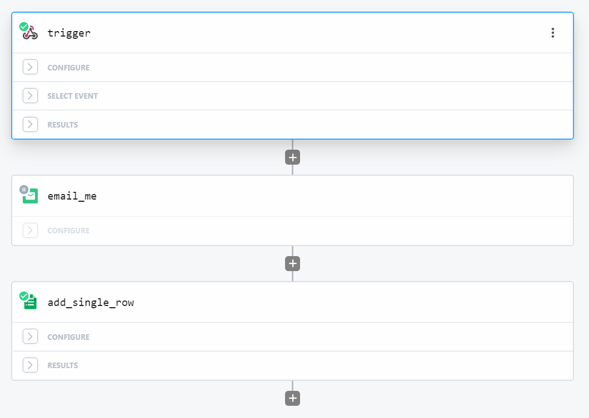

# Versione homemade di "Se mi perdo"

## Example
https://whereismy.pages.dev/?tag_id=100&tag_name=John%20Doe&tag_phone=0510000

](res/qrcode.png)

### Funzionamento parametri
| Nome Parametro | Funzionamento                                                    |
|----------------|------------------------------------------------------------------|
| tag_ig         | inutilizzato al momento                                          |
| tag_name       | nome del tag, usato nella pagina web e nel messaggio di notifica |
| tag_phone      | telefono dell'owner, usato nella pagina web                      |

## Stack
- HTML semplice con **Bootstrap**
- Codice pubblicato su **Github** con deploy diretto su **Cloudflare pages**
- Il click sul bottone triggera una chiamata su **Pipedream** che a sua volta invia una mail

## TO-DOs
- Rendere dinamico l'indirizzo di invio della mail (o sostituire con altro servizio di messaggistica - forse Telegram)
- Tracking delle scansioni
